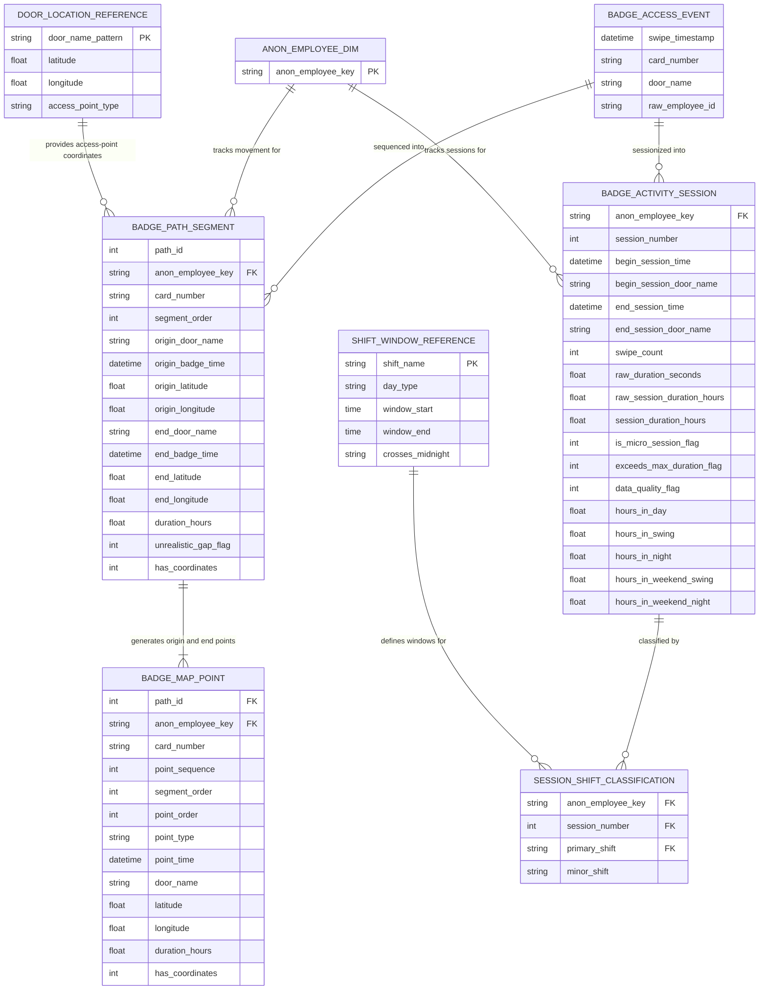

# Entity Relationship Diagram

## Facility Movement & Shift Presence Analytics

This diagram describes analytical products derived from access-control badge events. It does not represent GPS tracking, device telemetry, or continuous employee location monitoring. Coordinates are attributes of fixed access points.

---

## Notes on Design

**Why BADGE_ACCESS_EVENT feeds two separate outputs:**
The same event source supports two different analytical questions. The pathing pipeline answers where people moved and how long each movement took. The session pipeline answers when people were active and which shift they most likely worked. Both are derived from the same badge history, but with different transformation logic applied.

**Why pathing is modeled as an inference:**
The model orders swipes and pairs each observed access point with the next observed access point. That sequence can support movement visualization, but it is not a complete physical route and should not be described as GPS tracking.

**Why ANON_EMPLOYEE_DIM exists as a separate entity:**
The raw event table contains employee IDs. Those IDs are hashed before any downstream use. The anonymized key is treated as the stable identity anchor across both pipelines, allowing session tracking and path association without retaining or exposing raw employee data.

**Why DOOR_LOCATION_REFERENCE uses pattern matching:**
Access control systems often have door names that follow naming conventions with slight variations. The reference table uses patterns so a single reference entry can match multiple related doors without requiring an exact-string join for every access point.

**Why coordinates belong only to access points:**
Latitude and longitude values are properties of fixed doors, gates, or controlled locations. The anonymized employee key never carries a coordinate attribute.

**Why BADGE_MAP_POINT has two rows per segment:**
Map visualization tools need discrete geographic points to draw lines. Each movement segment generates one origin point and one destination point. The `point_sequence` field combines segment order and point order so the full path can be ordered and rendered correctly in a single sorted dataset.

**Why SHIFT_WINDOW_REFERENCE is modeled separately:**
Shift windows are configuration, not event data. Modeling them as a reference dimension makes the logic explicit and easier to audit, change, or extend. In the SQL implementation, shift windows are evaluated via interval intersection arithmetic rather than a literal join, but the reference model represents the business definition.

**Why data quality flags are part of the output:**
Badge telemetry can include duplicate swipes, missing events, single-swipe sessions, and unrealistic long gaps. Flags allow downstream dashboards to filter questionable records while preserving transparency about what was observed.
