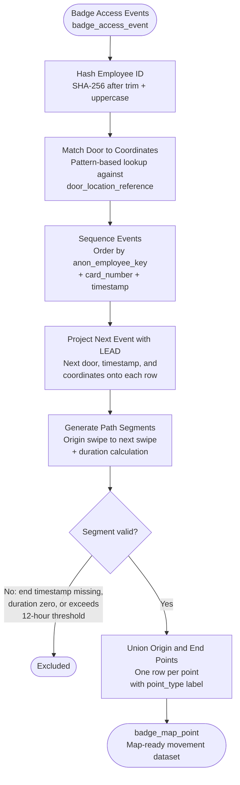
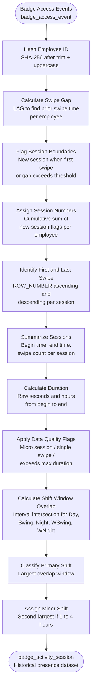
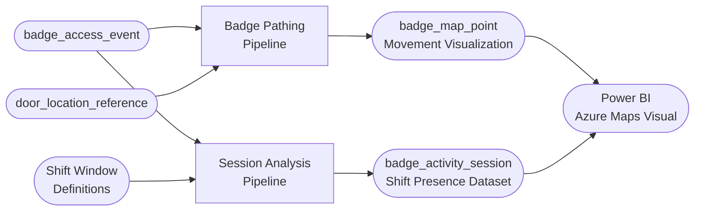

# Pipeline Flow Diagrams

## Facility Movement & Shift Presence Analytics

---

## Badge Pathing Pipeline

```mermaid
flowchart TD
    A([Badge Access Events\nbadge_access_event]) --> B[Hash Employee ID\nSHA-256 after trim + uppercase]
    B --> C[Match Door to Coordinates\nPattern-based lookup against\ndoor_location_reference]
    C --> D[Sequence Events\nOrder by anon_employee_key\n+ card_number + timestamp]
    D --> E[Project Next Event with LEAD\nNext door, timestamp, and\ncoordinates onto each row]
    E --> F[Generate Path Segments\nOrigin swipe to next swipe\n+ duration calculation]
    F --> G{Segment valid?}
    G -- No: end timestamp missing,\nduration zero, or exceeds\n12-hour threshold --> H([Excluded])
    G -- Yes --> I[Union Origin and End Points\nOne row per point\nwith point_type label]
    I --> J([badge_map_point\nMap-ready movement dataset])
```

---

## Activity Session Pipeline

```mermaid
flowchart TD
    A([Badge Access Events\nbadge_access_event]) --> B[Hash Employee ID\nSHA-256 after trim + uppercase]
    B --> C[Calculate Swipe Gap\nLAG to find prior swipe time\nper employee]
    C --> D[Flag Session Boundaries\nNew session when first swipe\nor gap exceeds threshold]
    D --> E[Assign Session Numbers\nCumulative sum of\nnew-session flags per employee]
    E --> F[Identify First and Last Swipe\nROW_NUMBER ascending and\ndescending per session]
    F --> G[Summarize Sessions\nBegin time, end time,\nswipe count per session]
    G --> H[Calculate Duration\nRaw seconds and hours\nfrom begin to end]
    H --> I[Apply Data Quality Flags\nMicro session / single swipe /\nexceeds max duration]
    I --> J[Calculate Shift Window Overlap\nInterval intersection for Day,\nSwing, Night, WSwing, WNight]
    J --> K[Classify Primary Shift\nLargest overlap window]
    K --> L[Assign Minor Shift\nSecond-largest if 1 to 4 hours]
    L --> M([badge_activity_session\nHistorical presence dataset])
```

---

## Combined Source and Output View

```mermaid
flowchart LR
    src([badge_access_event]) --> path[Badge Pathing\nPipeline]
    src --> session[Session Analysis\nPipeline]

    ref([door_location_reference]) --> path
    shift([Shift Window\nDefinitions]) --> session

    path --> map([badge_map_point\nMovement Visualization])
    session --> presence([badge_activity_session\nShift Presence Dataset])

    map --> pbi([Power BI\nAzure Maps Visual])
    presence --> pbi
```
