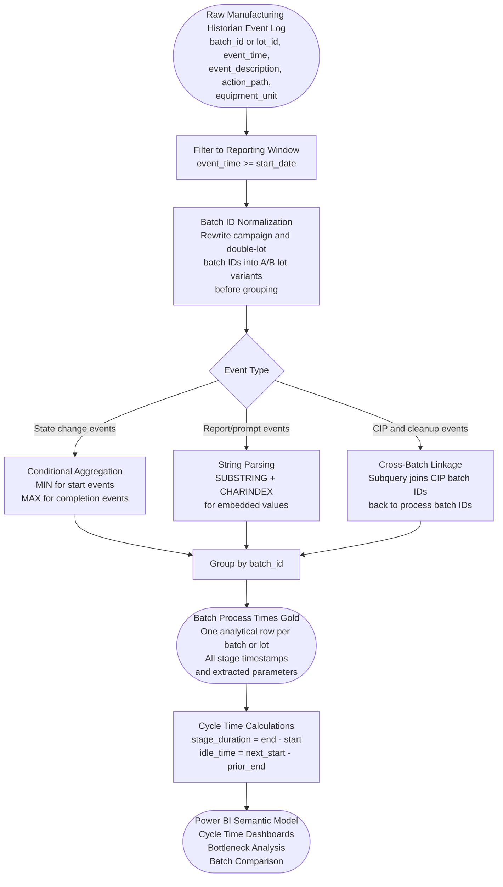
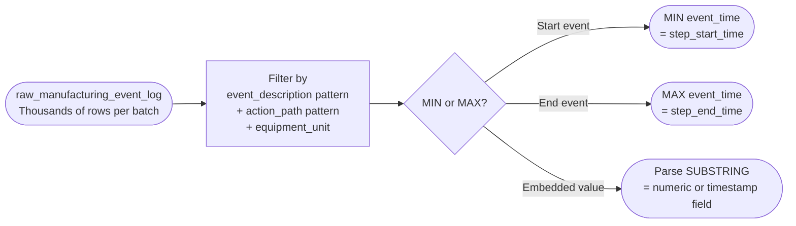
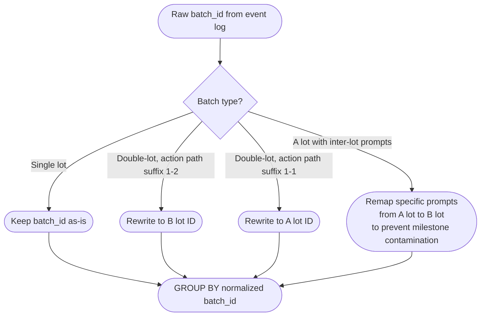
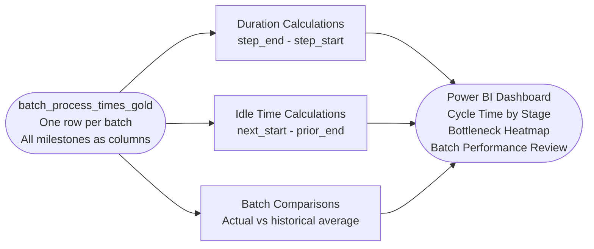

# Pipeline Flow Diagram

## Manufacturing Process Event Time Extraction Pipeline

---

This is a pipeline/system flow diagram rather than a relational ERD because the core modeling challenge is event-to-milestone transformation. The source is an automation historian/event log; the output is one analytical timing record per normalized batch or lot.

## End-to-End Data Flow

---

## Event-to-Milestone Mapping Pattern

Starts use `MIN(event_time)` because the first valid qualifying signal represents the start of a step. Ends use `MAX(event_time)` because the final valid qualifying signal represents completion, especially when repeated state changes or parallel equipment paths are present.

---

## Batch ID Normalization Flow

---

## Output to Downstream Analytics

