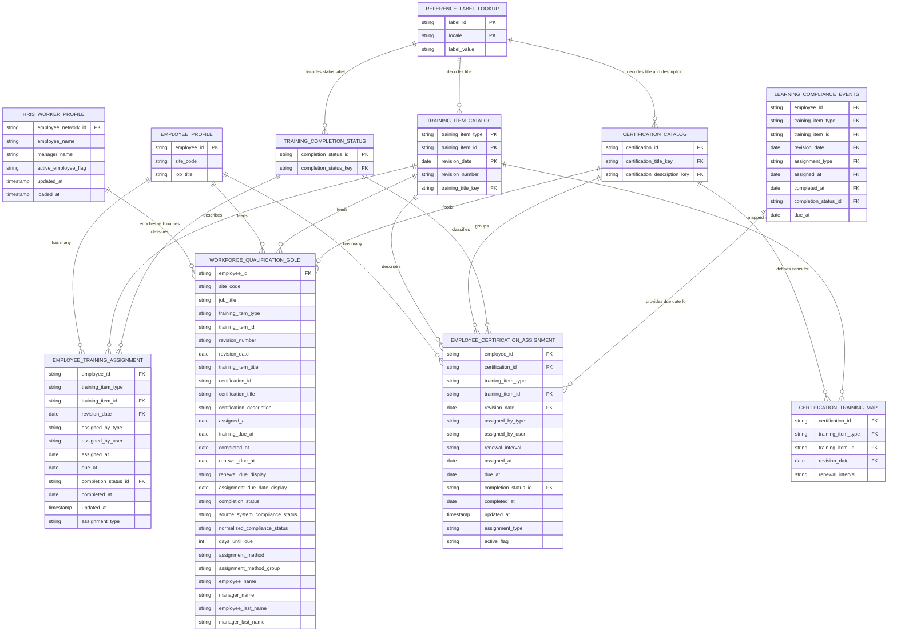

# Entity Relationship Diagram

## Workforce Qualification Intelligence Platform

The ERD below shows the source tables that feed the gold-layer view, their relationships, and the final output.

---

## Notes on Design

**Why REFERENCE_LABEL_LOOKUP connects to multiple tables:**
The source learning platform stores display values as internal label keys. The same lookup table decodes training item titles, certification titles, certification descriptions, and completion status labels. In the SQL, this is handled by joining the same table multiple times using separate aliases.

**Why HRIS_WORKER_PROFILE is separate from EMPLOYEE_PROFILE:**
The learning platform employee profile provides assignment-relevant attributes like site code and job title. Employee and manager display names are sourced from the governed HRIS system to keep identity reporting centralized through a single master data source.

**Why LEARNING_COMPLIANCE_EVENTS is included:**
The learning platform stores finalized due-date context for completed assignments in a separate compliance events table. The pipeline uses these values when available to ensure due-date accuracy reflects the source system's finalized completion state.

**Why CERTIFICATION_TRAINING_MAP exists:**
Renewal intervals are configured at the certification-training level, not at the assignment level. This mapping table is the authoritative source for how long a specific training item remains valid within a given certification before requiring renewal.
